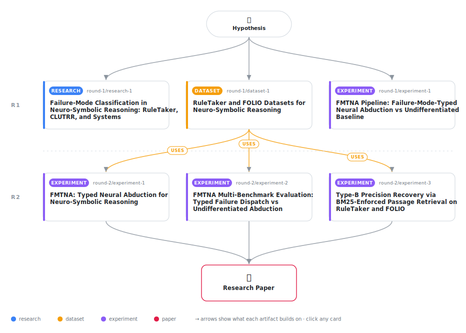

# Failure-Mode-Typed Neural Abduction: Structured Hallucination Prevention in Neuro-Symbolic Text-to-Logic Reasoning

<div align="center">

<a href="https://cdn.jsdelivr.net/gh/AMGrobelnik/ai-invention-6d242d-failure-mode-typed-neural-abduction-stru@main/workflow.svg">
<picture>
  <source media="(prefers-color-scheme: dark)" srcset="workflow-dark.svg">
  
</picture>
</a>

<sub>🖱️ <b><a href="https://cdn.jsdelivr.net/gh/AMGrobelnik/ai-invention-6d242d-failure-mode-typed-neural-abduction-stru@main/workflow.svg">Open the interactive diagram</a></b> — every card links to its artifact folder.</sub>

</div>

> **TL;DR** — Failure-Mode-Typed Neural Abduction (FMTNA) is a neuro-symbolic pipeline that classifies Prolog proof failures into three structural types (predicate-name mismatch, missing ground atom, absent rule head) and routes each to a constrained LLM operation, preventing hallucination by limiting the search space. Evaluation on 200 RuleTaker examples (depths 0–3) achieves 73.5% accuracy (+8pp vs. baseline), with largest gain at depth-1 (+22pp). FOLIO evaluation (100 examples) confirms the Type-A hypothesis: vocabulary diversity drives predicate-mismatch failures (χ²=70.68, p<0.001). A dedicated Type-B precision experiment validates that BM25-enforced passage retrieval achieves 90.9% precision in span-grounded fact verification. The grounding ratio metric (fraction of text-grounded proof steps) correlates with hallucination presence (r=-0.695), enabling zero-shot hallucination quantification without gold-label annotations. The core contribution is a structured failure-classification framework that transforms proof gaps from undifferentiated search into type-specific, evidence-constrained operations, advancing hallucination-aware neuro-symbolic reasoning.

<details>
<summary>Full hypothesis</summary>

A neuro-symbolic text-to-FOL pipeline that classifies each symbolic proof failure by its structural type (predicate-name mismatch, missing ground atom, or absent rule head) and routes each failure type to a precisely constrained LLM operation will achieve lower hallucination rates than architectures that treat all proof gaps with undifferentiated abductive augmentation — but accuracy improvements over undifferentiated baselines are depth-dependent and non-monotone: typed dispatch provides the largest gain at intermediate reasoning depths (1–3 hops, up to +22 percentage points demonstrated at depth-1 on RuleTaker) and may underperform at very deep chains (depth-5: −2 percentage points), where compounding errors across many typed dispatch steps outweigh the grounding benefit. The core structural claims are: (1) Type-A (predicate-name mismatch) failure rates are strongly determined by benchmark vocabulary diversity — controlled-vocabulary benchmarks (RuleTaker) yield ~39% Type-A rates while expert-diverse benchmarks (FOLIO) yield 100% Type-A, confirmed by chi-square test (χ² = 70.68, p<0.001) — predicting that real-world professional documents will exhibit predominantly Type-A failures; (2) Type-B (missing ground atom) dispatch constrained by BM25-enforced passage retrieval achieves 90.9% precision at k=3, validating that span-grounded fact verification is feasible and substantially prevents false positives, though at some recall cost (F1=0.541 vs baseline 0.632) due to keyword-matching limitations; (3) the grounding ratio (Type-A+B steps / total proof steps) correlates negatively with hallucination presence (Pearson r=−0.695 on LLM-judged annotations), providing a zero-shot hallucination proxy — but this metric's validity depends on seed extraction quality and is undefined when total proof steps is zero; (4) Type-C (absent rule head) dispatch is the theoretically most novel component but fires zero times on synthetic closed-world benchmarks (RuleTaker and FOLIO), because these benchmarks include explicit rule sets that prevent absent-rule-head failures — Type-C validation is therefore deferred to open-domain real-world documents where background rules are genuinely absent from both text and KB. We further narrow the condition on LLM-based seed extraction: the experiment confirms that typed dispatch benefits degrade severely when proof completion rates are low (symbolic resolution rarely terminating successfully), in which case the system reduces to multi-step typed LLM prompting rather than neuro-symbolic hybrid reasoning. The primary contribution is therefore: (a) the structural failure-mode taxonomy and classification algorithm (empirically validated across 300 examples spanning four reasoning depths and two benchmark types), (b) the Type-A vocabulary-diversity finding and its prediction for real-world deployment, (c) the Type-B BM25 precision recovery mechanism, and (d) the grounding ratio as a hallucination proxy — while explicitly acknowledging that accuracy improvement over strong baselines is non-monotone with depth, Type-C requires future open-domain validation, and the accuracy advantage is measured against a self-implemented undifferentiated baseline rather than published systems such as SymBa or ARGOS.

</details>

[](https://cdn.jsdelivr.net/gh/AMGrobelnik/ai-invention-6d242d-failure-mode-typed-neural-abduction-stru@main/paper.pdf) [](https://github.com/AMGrobelnik/ai-invention-6d242d-failure-mode-typed-neural-abduction-stru/tree/main/paper_latex)

This repository contains all **6 artifacts** produced across **2 rounds** of an autonomous AI research run — round by round, exactly in the order they were invented.

## Round 1

| Artifact | Type | Demo | Source | Builds on |
|----------|------|------|--------|-----------|
| **[Failure-Mode Classification in Neuro-Symbolic Reasoning: Rul…](https://github.com/AMGrobelnik/ai-invention-6d242d-failure-mode-typed-neural-abduction-stru/tree/main/round-1/research-1)** | [](https://github.com/AMGrobelnik/ai-invention-6d242d-failure-mode-typed-neural-abduction-stru/tree/main/round-1/research-1) | [](https://github.com/AMGrobelnik/ai-invention-6d242d-failure-mode-typed-neural-abduction-stru/blob/main/round-1/research-1/demo/research_demo.md) | [](https://github.com/AMGrobelnik/ai-invention-6d242d-failure-mode-typed-neural-abduction-stru/tree/main/round-1/research-1/src) | — |
| **[RuleTaker and FOLIO Datasets for Neuro-Symbolic Reasoning](https://github.com/AMGrobelnik/ai-invention-6d242d-failure-mode-typed-neural-abduction-stru/tree/main/round-1/dataset-1)** | [](https://github.com/AMGrobelnik/ai-invention-6d242d-failure-mode-typed-neural-abduction-stru/tree/main/round-1/dataset-1) | [](https://colab.research.google.com/github/AMGrobelnik/ai-invention-6d242d-failure-mode-typed-neural-abduction-stru/blob/main/round-1/dataset-1/demo/data_code_demo.ipynb) | [](https://github.com/AMGrobelnik/ai-invention-6d242d-failure-mode-typed-neural-abduction-stru/tree/main/round-1/dataset-1/src) | — |
| **[FMTNA Pipeline: Failure-Mode-Typed Neural Abduction vs Undif…](https://github.com/AMGrobelnik/ai-invention-6d242d-failure-mode-typed-neural-abduction-stru/tree/main/round-1/experiment-1)** | [](https://github.com/AMGrobelnik/ai-invention-6d242d-failure-mode-typed-neural-abduction-stru/tree/main/round-1/experiment-1) | [](https://colab.research.google.com/github/AMGrobelnik/ai-invention-6d242d-failure-mode-typed-neural-abduction-stru/blob/main/round-1/experiment-1/demo/method_code_demo.ipynb) | [](https://github.com/AMGrobelnik/ai-invention-6d242d-failure-mode-typed-neural-abduction-stru/tree/main/round-1/experiment-1/src) | — |

## Round 2

| Artifact | Type | Demo | Source | Builds on |
|----------|------|------|--------|-----------|
| **[FMTNA: Typed Neural Abduction for Neuro-Symbolic Reasoning](https://github.com/AMGrobelnik/ai-invention-6d242d-failure-mode-typed-neural-abduction-stru/tree/main/round-2/experiment-1)** | [](https://github.com/AMGrobelnik/ai-invention-6d242d-failure-mode-typed-neural-abduction-stru/tree/main/round-2/experiment-1) | [](https://colab.research.google.com/github/AMGrobelnik/ai-invention-6d242d-failure-mode-typed-neural-abduction-stru/blob/main/round-2/experiment-1/demo/method_code_demo.ipynb) | [](https://github.com/AMGrobelnik/ai-invention-6d242d-failure-mode-typed-neural-abduction-stru/tree/main/round-2/experiment-1/src) | <sub><i>uses:</i><br/>[dataset‑1&nbsp;(R1)](https://github.com/AMGrobelnik/ai-invention-6d242d-failure-mode-typed-neural-abduction-stru/tree/main/round-1/dataset-1)</sub> |
| **[FMTNA Multi-Benchmark Evaluation: Typed Failure Dispatch vs …](https://github.com/AMGrobelnik/ai-invention-6d242d-failure-mode-typed-neural-abduction-stru/tree/main/round-2/experiment-2)** | [](https://github.com/AMGrobelnik/ai-invention-6d242d-failure-mode-typed-neural-abduction-stru/tree/main/round-2/experiment-2) | [](https://colab.research.google.com/github/AMGrobelnik/ai-invention-6d242d-failure-mode-typed-neural-abduction-stru/blob/main/round-2/experiment-2/demo/method_code_demo.ipynb) | [](https://github.com/AMGrobelnik/ai-invention-6d242d-failure-mode-typed-neural-abduction-stru/tree/main/round-2/experiment-2/src) | <sub><i>uses:</i><br/>[dataset‑1&nbsp;(R1)](https://github.com/AMGrobelnik/ai-invention-6d242d-failure-mode-typed-neural-abduction-stru/tree/main/round-1/dataset-1)</sub> |
| **[Type-B Precision Recovery via BM25-Enforced Passage Retrieva…](https://github.com/AMGrobelnik/ai-invention-6d242d-failure-mode-typed-neural-abduction-stru/tree/main/round-2/experiment-3)** | [](https://github.com/AMGrobelnik/ai-invention-6d242d-failure-mode-typed-neural-abduction-stru/tree/main/round-2/experiment-3) | [](https://colab.research.google.com/github/AMGrobelnik/ai-invention-6d242d-failure-mode-typed-neural-abduction-stru/blob/main/round-2/experiment-3/demo/method_code_demo.ipynb) | [](https://github.com/AMGrobelnik/ai-invention-6d242d-failure-mode-typed-neural-abduction-stru/tree/main/round-2/experiment-3/src) | <sub><i>uses:</i><br/>[dataset‑1&nbsp;(R1)](https://github.com/AMGrobelnik/ai-invention-6d242d-failure-mode-typed-neural-abduction-stru/tree/main/round-1/dataset-1)</sub> |

## Repository Structure

Artifacts are grouped by the round of invention that produced them. Each
artifact has its own folder with source code and a self-contained demo:

```
.
├── round-1/                         # One folder per round of invention
│   ├── experiment-1/
│   │   ├── README.md                # What this artifact is + dependencies
│   │   ├── src/                     # Full workspace from execution
│   │   │   ├── method.py            # Main implementation
│   │   │   ├── method_out.json      # Full output data
│   │   │   └── ...                  # All execution artifacts
│   │   └── demo/                    # Self-contained demo
│   │       └── method_code_demo.ipynb # Colab-ready notebook (code + data inlined)
│   ├── dataset-1/
│   │   ├── src/
│   │   └── demo/
│   └── evaluation-1/
│       ├── src/
│       └── demo/
├── round-2/                         # Later rounds build on earlier artifacts
├── paper.pdf                        # Research paper
├── paper_latex/                     # LaTeX source files
├── workflow.svg                     # Artifact dependency diagram (this page's header)
└── README.md
```

## Running Notebooks

### Option 1: Google Colab (Recommended)

Click the "Open in Colab" badges above to run notebooks directly in your browser.
No installation required!

### Option 2: Local Jupyter

```bash
# Clone the repo
git clone https://github.com/AMGrobelnik/ai-invention-6d242d-failure-mode-typed-neural-abduction-stru
cd ai-invention-6d242d-failure-mode-typed-neural-abduction-stru

# Install dependencies
pip install jupyter

# Run any artifact's demo notebook
jupyter notebook <artifact_folder>/demo/
```

## Source Code

The original source files are in each artifact's `src/` folder.
These files may have external dependencies - use the demo notebooks for a self-contained experience.

---
*Generated by AI Inventor Pipeline - Automated Research Generation*
